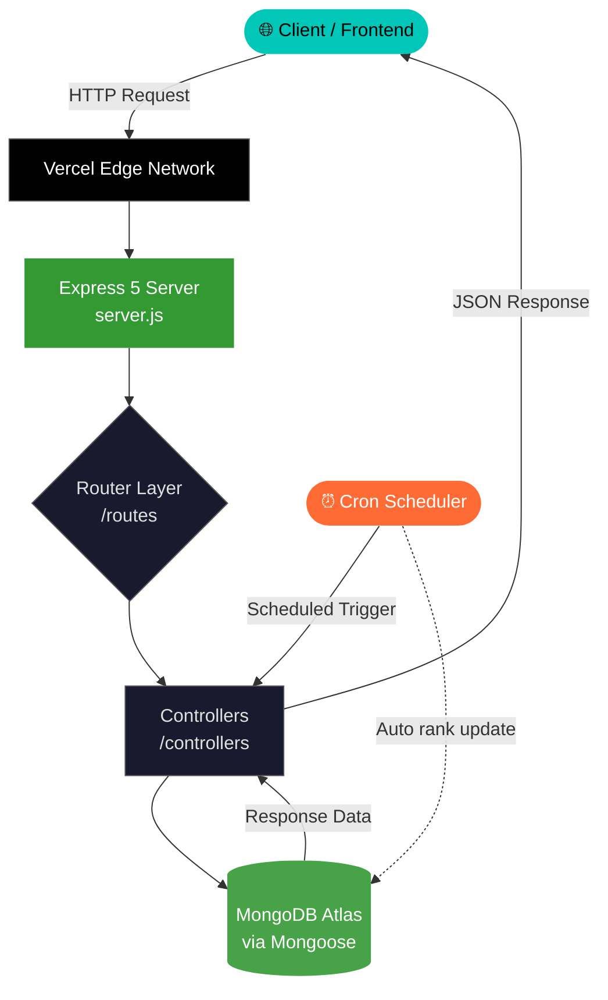

<div align="center">

```
██╗     ███████╗ █████╗ ██████╗ ███████╗██████╗ ██████╗  ██████╗  █████╗ ██████╗ ██████╗ 
██║     ██╔════╝██╔══██╗██╔══██╗██╔════╝██╔══██╗██╔══██╗██╔═══██╗██╔══██╗██╔══██╗██╔══██╗
██║     █████╗  ███████║██║  ██║█████╗  ██████╔╝██████╔╝██║   ██║███████║██████╔╝██║  ██║
██║     ██╔══╝  ██╔══██║██║  ██║██╔══╝  ██╔══██╗██╔══██╗██║   ██║██╔══██║██╔══██╗██║  ██║
███████╗███████╗██║  ██║██████╔╝███████╗██║  ██║██████╔╝╚██████╔╝██║  ██║██║  ██║██████╔╝
╚══════╝╚══════╝╚═╝  ╚═╝╚═════╝ ╚══════╝╚═╝  ╚═╝╚═════╝  ╚═════╝ ╚═╝  ╚═╝╚═╝  ╚═╝╚═════╝ 
                                                          B A C K E N D
```

### ⚡ The engine powering BugByte 2026 — built for speed, ranked for glory

<br/>

[](https://nodejs.org/)
[](https://expressjs.com/)
[](https://www.mongodb.com/)
[](https://mongoosejs.com/)
[](https://leader-board-backend.vercel.app)

<br/>

[](https://leader-board-backend.vercel.app)
[](LICENSE)
[](https://nodejs.org/api/esm.html)
[](https://github.com/kelektiv/node-cron)

</div>

---

## 🧠 What is This?

The **LeaderBoard Backend** is a production-grade REST API powering the **BugByte 2026** competitive programming contest leaderboard for **Ignite Club**. It handles real-time participant rankings, scheduled score updates via cron jobs, and serves clean JSON data to the frontend — all deployed serverlessly on Vercel.

> Built lean. Runs mean. Ranks supreme.

---

## 🏗️ Architecture & Pipeline



### 🔁 Request Lifecycle

```
  📥 Incoming Request
        │
        ▼
  ┌─────────────────┐
  │  Vercel Edge    │  ← Global CDN, SSL termination
  └────────┬────────┘
           │
           ▼
  ┌─────────────────┐
  │  CORS Middleware │  ← Cross-origin handling
  └────────┬────────┘
           │
           ▼
  ┌─────────────────┐
  │  Express Router │  ← Route matching & param parsing
  └────────┬────────┘
           │
           ▼
  ┌─────────────────┐
  │   Controller    │  ← Business logic lives here
  └────────┬────────┘
           │
           ▼
  ┌─────────────────┐
  │ Mongoose Model  │  ← Schema validation + DB ops
  └────────┬────────┘
           │
           ▼
  ┌─────────────────┐
  │  MongoDB Atlas  │  ← Cloud-hosted NoSQL store
  └────────┬────────┘
           │
           ▼
        📤 JSON Response
```

---

## 🛠️ Tech Stack

| Layer | Technology | Purpose |
|-------|-----------|---------|
| **Runtime** |  | JavaScript server runtime |
| **Framework** |  | HTTP routing & middleware |
| **Database** |  | Cloud NoSQL document store |
| **ODM** |  | Schema modeling & validation |
| **Scheduler** |  | Automated scheduled jobs |
| **Security** |  | Cross-origin policy control |
| **Config** |  | Environment variable management |
| **Deploy** |  | Serverless deployment |
| **Module System** |  | Native `import/export` syntax |

---

## 📁 Project Structure

```
LeaderBoard_Backend/
│
├── 📂 config/
│   └── db.js               # MongoDB Atlas connection via Mongoose
│
├── 📂 controllers/
│   └── *.js                # Business logic — CRUD ops, ranking algorithms
│
├── 📂 models/
│   └── *.js                # Mongoose schemas (Participant, Score, etc.)
│
├── 📂 routes/
│   └── *.js                # Express route definitions & endpoint mapping
│
├── 📄 server.js            # App entry point — Express init, middleware, cron
├── 📄 package.json         # Dependencies & scripts
├── 📄 .gitignore           # Secrets & node_modules excluded
└── 📄 vercel.json          # Vercel deployment config (if present)
```

---

## ⚙️ Environment Variables

Create a `.env` file in the root directory:

```env
# ─── Database ──────────────────────────────
MONGO_URI=mongodb+srv://<username>:<password>@cluster.mongodb.net/<dbname>?retryWrites=true&w=majority

# ─── Server ────────────────────────────────
PORT=5000

# ─── CORS ──────────────────────────────────
CLIENT_URL=https://your-frontend.vercel.app
```

> ⚠️ **Never commit your `.env` file.** It's already in `.gitignore`.

---

## 🚀 Getting Started

### Prerequisites

```bash
node --version   # v18+ required
npm --version    # v9+ recommended
```

### Installation

```bash
# 1. Clone the repository
git clone https://github.com/aarav12e/LeaderBoard_Backend.git
cd LeaderBoard_Backend

# 2. Install dependencies
npm install

# 3. Set up environment variables
cp .env.example .env
# → Fill in your MONGO_URI and other secrets

# 4. Start the development server
npm start
```

The server fires up at `http://localhost:5000` 🔥

---

## 📡 API Endpoints

> Base URL (Production): `https://leader-board-backend.vercel.app`

| Method | Endpoint | Description |
|--------|----------|-------------|
| `GET` | `/api/leaderboard` | Fetch full ranked leaderboard |
| `GET` | `/api/leaderboard/:id` | Get a specific participant's data |
| `POST` | `/api/leaderboard` | Add a new participant |
| `PUT` | `/api/leaderboard/:id` | Update participant score/rank |
| `DELETE` | `/api/leaderboard/:id` | Remove a participant |

> 📌 Actual endpoints may vary — check `/routes` for the ground truth.

---

## ⏰ Cron Jobs

The server runs **scheduled cron tasks** to automate ranking operations:

```
  ┌───── second (optional)
  │ ┌───── minute
  │ │ ┌───── hour
  │ │ │ ┌───── day of month
  │ │ │ │ ┌───── month
  │ │ │ │ │ ┌───── day of week
  │ │ │ │ │ │
  * * * * * *
```

Example jobs configured in this project:
- 🔄 **Rank recalculation** — Recomputes and sorts participant standings
- 🧹 **Data cleanup** — Removes stale or invalid entries on schedule

Powered by [`node-cron v4`](https://github.com/node-cron/node-cron).

---

## ☁️ Deployment

This backend is deployed on **Vercel** as a serverless Node.js application.

```
📦 Push to main
     │
     ▼
🔁 Vercel Auto-Deploy
     │
     ▼
🌐 Live at leader-board-backend.vercel.app
```

### Deploy your own fork:

```bash
# Install Vercel CLI
npm i -g vercel

# Login & deploy
vercel login
vercel --prod
```

> Make sure to add your environment variables in **Vercel Dashboard → Settings → Environment Variables**.

---

## 📦 Dependencies

```json
{
  "cors":     "^2.8.6",    // Cross-origin resource sharing
  "cron":     "^4.4.0",    // Scheduled job execution
  "dotenv":   "^17.2.4",   // Environment variable loader
  "express":  "^5.2.1",    // HTTP server framework
  "mongoose": "^9.1.6"     // MongoDB object modeling
}
```

---

## 🤝 Contributing

Pull requests are welcome! Here's the flow:

```bash
# Fork → Clone → Branch
git checkout -b feature/your-feature-name

# Make changes → Commit
git commit -m "feat: add your feature"

# Push → Open PR
git push origin feature/your-feature-name
```

---

## 👨‍💻 Author

<div align="center">

**Aarav Kumar**
*Backend Developer · Ignite Club · BugByte 2026*

[](https://github.com/aarav12e)

</div>

---

<div align="center">

*Built with 🔥 for the competitive programmers of BugByte 2026*

**`< / Ignite Club >`**

</div>
